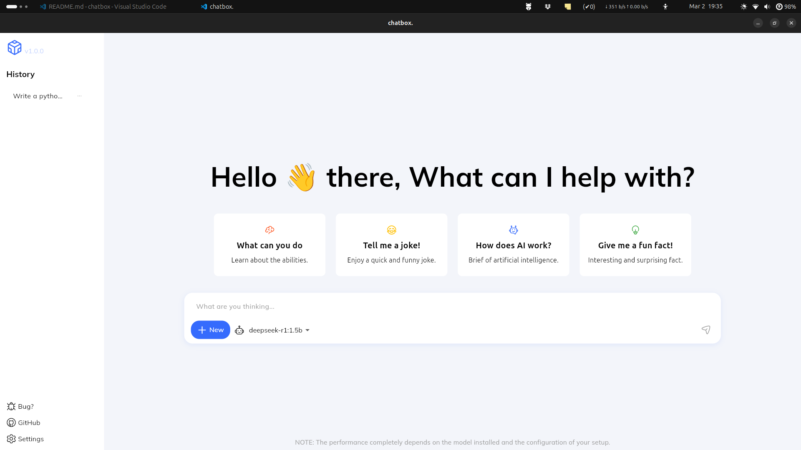

# Chatbox

Chatbox is a Flutter project that provides a graphical user interface (GUI) for running large language models (LLMs) using the Ollama. This application allows users to interact with various LLM models, send messages, and receive responses in a chat-like interface.




## Features

- **Model Selection**: Choose from a list of available LLM models.
- **Interactive Chat**: Send messages and receive responses from the selected model.
- **Real-time Typing Indicator**: See when the model is generating a response.
- **Copy to Clipboard**: Easily copy messages to your clipboard.
- **Re-answer Messages**: Request the model to re-answer a message.

## Getting Started

### Prerequisites

- Flutter SDK: [Install Flutter](https://flutter.dev/docs/get-started/install)
- Ollama: [Ollama](https://ollama.ai) must be installed in your system.

### Installation

1. Clone the repository:
   ```sh
   git clone https://github.com/udaykumar-dhokia/chatbox.git
   cd chatbox
   ```

2. Install dependencies:
   ```sh
   flutter pub get
   ```

3. Run the application:
   ```sh
   flutter run
   ```

## Usage

1. Select a model from the dropdown menu.
2. Type your message in the input field.
3. Press the send button or hit enter to send the message.
4. View the model's response in the chat interface.

## Resources

- [Lab: Write your first Flutter app](https://docs.flutter.dev/get-started/codelab)
- [Cookbook: Useful Flutter samples](https://docs.flutter.dev/cookbook)
- [Ollama API Documentation](https://ollama.ai/docs)

For help getting started with Flutter development, view the [online documentation](https://docs.flutter.dev/), which offers tutorials, samples, guidance on mobile development, and a full API reference.

## License

This project is licensed under the MIT License - see the [LICENSE](LICENSE) file for details.
